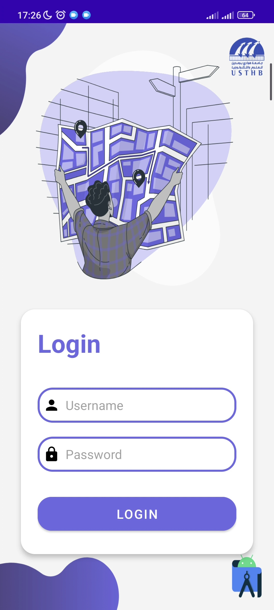
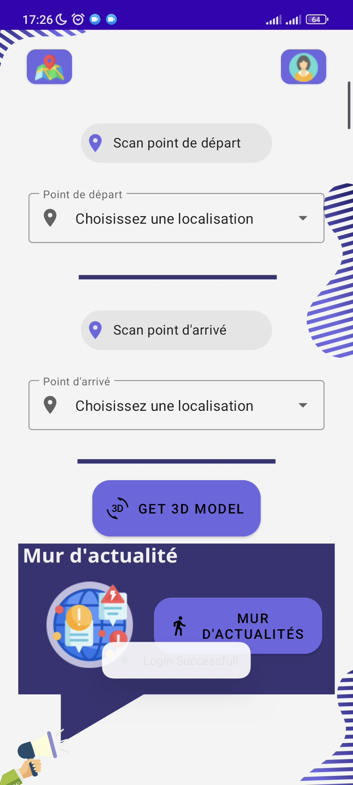
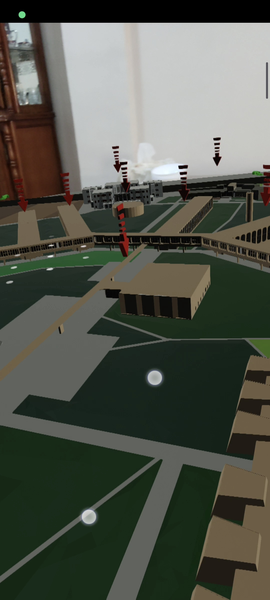

#    Where-in-USTHB - Your Guide to University Exploration

Where-in-USTHB  is an innovative Android mobile app designed to assist new students in navigating their university campus using Augmented Reality (AR) technology.

  

## Features:
- **Interactive Experience**: Engage with interactive features such as a news wall, where you can access different news and instructions.
- **AR Navigation**: Utilize AR technology to overlay campus maps and directional cues in real-time, making it easier for new students to find their way around campus.
- *Paths**: Personalize your journey by selecting your destination using the selection bar or by scanning QR codes posted throughout the university.

  

.

- **User-Friendly Interface**: Intuitive design and user-friendly interface ensure smooth navigation and seamless integration with university resources.
- **Secured**: Benefit from enhanced security measures, including user login and profiles, to safeguard personal information and ensure a secure experience.

## Some app Screenshots

  
  
  

.

## Contributors

- [@RB-Younes](https://github.com/RB-Younes)
- [@NaaaaaaaaaaDaa](https://github.com/NaaaaaaaaaaDaa)
